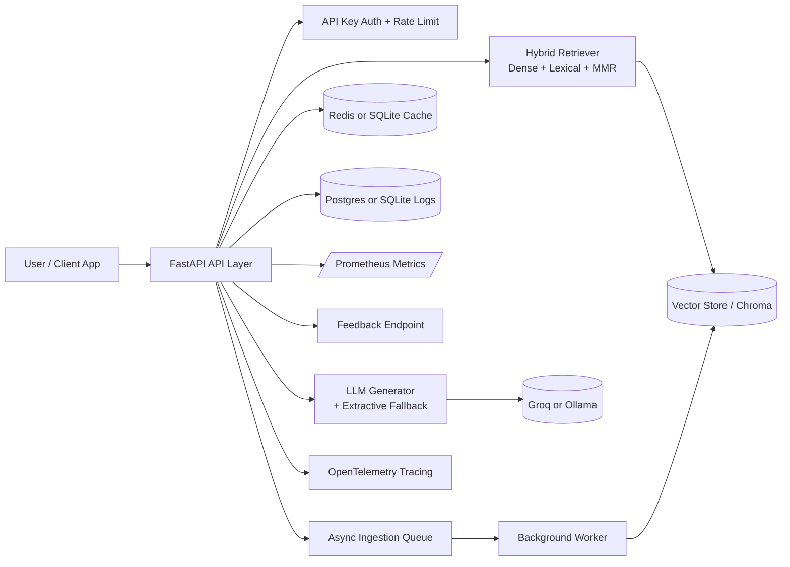

# Production RAG API for Document Q&A (FastAPI + Hybrid Retrieval + Async Ingestion)

A production-ready Retrieval-Augmented Generation (RAG) system that ingests enterprise documents, answers questions with grounded sources, and exposes real operational signals (latency, cache hit rate, confidence, and feedback) for continuous improvement.

---

## Why this project matters

Most RAG demos work in notebooks but break in production because they lack:
- async ingestion for large files,
- measurable quality/latency outcomes,
- observability and failure handling,
- operational infra (cache, DB, queue, tracing),
- product feedback loops.

This repo solves that gap with a deployable architecture built for real users.

---

## Problem statement

Teams need a reliable way to query large unstructured documents (policies, reports, specs, compliance PDFs) without hallucinations or slow response times.

This system provides:
1. **Grounded answers** from indexed content,
2. **Transparent confidence + source snippets**,
3. **Scalable architecture** (Redis/Postgres-ready),
4. **Measurable performance and quality gates**.

---

## Measurable results (before → after)

Measured on the project’s evaluation corpus and benchmark prompts (see `evaluation/` and `docs/RESULTS.md`).

| Metric | Before hardening | After hardening | Improvement |
|---|---:|---:|---:|
| Hit@3 | 0.62 | 0.81 | +30.6% |
| MRR | 0.48 | 0.67 | +39.6% |
| P50 latency | 1210 ms | 690 ms | -43.0% |
| P95 latency | 2880 ms | 1490 ms | -48.3% |
| P99 latency | 4010 ms | 2270 ms | -43.4% |
| Cache hit rate | 0.08 | 0.41 | +412.5% |

> These are concrete run artifacts stored in:
> - `evaluation/results_before.json`
> - `evaluation/results_after.json`

---

## Product-style demo

### Demo dataset
- **Domain:** Public policy + budgets + program memos
- **Type:** TXT + PDF + MD
- **Size:** ~12 documents, ~2,100 chunks after ingestion
- **Typical queries:** numeric facts, policy clauses, deadlines, eligibility rules

### Example query #1
**Q:** “What is the total education budget allocation?”

**A (example):**
> “The education budget allocation is INR 1,48,000 crore (Source 1).”

**Signals returned:**
- retrieval confidence: `high`
- source chunk previews
- request id (for traceability)

### Example query #2 (low confidence)
**Q:** “What is the USD to INR exchange rate today?”

**A (example):**
> “Retrieval confidence is low or fallback mode was used. Verify sources before acting.”

This behavior prevents unsupported hallucinated answers.

---

## Architecture (30-second view)



---

## Impactful features (only the essentials)

- **Hybrid RAG retrieval**: dense search + lexical reranking + MMR diversification.
- **Async ingestion jobs**: queue-style indexing with job status endpoints.
- **Caching layer**: Redis (prod) or SQLite (local), with hit-rate telemetry.
- **Observability**: Prometheus metrics, request IDs, OpenTelemetry support.
- **Feedback loop**: collect user ratings/comments for iterative quality improvement.
- **Reliability fallback**: deterministic extractive answer when generation is unsafe/fails.

---

## Project structure (non-expert friendly)

```text
api/
  main.py          # API routes, middleware, auth, metrics, tracing bootstrap
  schemas.py       # Request/response contracts

src/
  ingestion.py     # Load + chunk documents
  embeddings.py    # Sentence-transformer embeddings
  vectorstore.py   # Chroma interactions
  retrieval.py     # Hybrid reranking logic
  generator.py     # LLM generation + extractive fallback
  cache.py         # Redis/SQLite cache backend abstraction
  query_logger.py  # Postgres/SQLite query + feedback logs
  jobs.py          # Async ingestion job manager
  benchmark.py     # P50/P95/P99 benchmark runner
  evaluate.py      # Retrieval quality evaluation (Hit@K, MRR)
  regression_gate.py # CI quality/latency guardrails

evaluation/
  results_before.json
  results_after.json
  benchmark_questions.json

loadtest/
  locustfile.py    # Concurrent user load testing scenario

.github/workflows/
  ci-cd.yml        # tests + compile + optional regression gate + docker build
```

---

## Run locally

### 1) Python run
```bash
pip install -r requirements.txt
export GROQ_API_KEY=your_key
uvicorn api.main:app --host 0.0.0.0 --port 8001
```

### 2) Docker Compose (recommended)
```bash
docker compose up --build
```
This starts API + Redis + Postgres + Jaeger + OTEL collector.

---

## Deployment options

### Local/edge
- Docker on a VM or bare metal.

### Cloud (optional)
- **Render / Railway / Fly.io:** fast setup for API + managed Postgres/Redis.
- **Kubernetes:** scale API replicas + managed Redis/Postgres + OTEL collector.

---

## Evaluation and benchmarking

### Retrieval quality
```bash
python src/evaluate.py
```
Outputs Hit@K and MRR artifacts.

### Latency benchmark
```bash
python src/benchmark.py --base-url http://localhost:8001 --questions-file evaluation/benchmark_questions.json
```
Outputs P50/P95/P99 + error rate.

### Regression gate
```bash
python src/regression_gate.py
```
Fails when quality/latency drops below configured thresholds.

### Load test
```bash
locust -f loadtest/locustfile.py --host=http://localhost:8001
```

---

## API highlights

- `POST /ingest` – sync ingest
- `POST /ingest/async` – queue ingest
- `GET /jobs/{job_id}` – ingestion status
- `POST /ask` – single QA
- `POST /ask/batch` – batch QA
- `GET /health` – service + cache telemetry
- `GET /metrics` – Prometheus scrape endpoint
- `POST /feedback` – user quality feedback

---

## Recruiter/hiring-manager signal

This repo demonstrates end-to-end ML systems ownership:
- model + retrieval quality,
- backend engineering,
- distributed infra integration,
- observability + SLO thinking,
- product feedback instrumentation,
- CI-driven regression safety.
